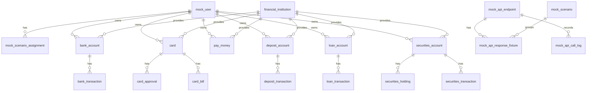

# Financial Mock Server

금융 API 연동 기능을 개발하고 테스트하기 위한 Spring MVC 기반 목 서버입니다.

실제 CODEF API를 매번 호출하지 않고, 로컬 MySQL의 mock 데이터를 조회해 안정적인 금융 응답을 제공합니다. 정상 응답뿐 아니라 빈 데이터, 토큰 만료, 호출 제한 같은 시나리오 응답도 함께 테스트할 수 있습니다.

## 목적

- 외부 금융 API 호출 없이 자산/거래/카드/대출 응답 테스트
- 사용자별 `scenarioKey` 기반 목 데이터 분기
- 정상 데이터는 DB 원천 테이블에서 조회해 응답 조립
- 오류/빈 데이터 등 특수 케이스는 fixture JSON으로 응답
- 실제 서비스 DB와 분리된 목 서버 전용 데이터 관리

## 현재 DB 기준

현재 코드가 조회하는 기준 스키마는 `src/main/resources/db/schema-v2.sql`입니다.

기존 `schema.sql`, `seed.sql`, `init.sql`에는 구버전 `mock_codef_*` 구조가 남아 있습니다. 현재 매퍼와 서비스는 주로 v2의 도메인 분리 테이블을 조회합니다.

## DB 구조

DB는 크게 두 영역으로 나뉩니다.

### 1. 목 응답 제어 영역

요청을 어떤 사용자, 어떤 API, 어떤 시나리오로 처리할지 결정하는 테이블입니다.

- `mock_user`: 테스트 사용자. `scenario_key`로 사용자를 식별합니다.
- `mock_scenario`: `NORMAL`, `EMPTY_DATA`, `TOKEN_EXPIRED`, `RATE_LIMITED` 같은 응답 시나리오입니다.
- `mock_api_endpoint`: 목 서버가 인식하는 API endpoint 목록입니다.
- `mock_scenario_assignment`: 사용자 또는 endpoint별 시나리오 배정 정보입니다.
- `mock_api_response_fixture`: NORMAL이 아닌 시나리오에서 반환할 고정 JSON 응답입니다.
- `mock_api_call_log`: 요청/응답 호출 이력을 저장합니다.

### 2. 금융 원천 데이터 영역

정상 시나리오에서 실제 응답을 조립할 때 조회하는 데이터입니다.

- `financial_institution`: 금융기관 마스터입니다. 은행, 카드사, 증권사, 페이머니 제공자를 포함합니다.
- `bank_account`: 입출금 계좌입니다.
- `bank_transaction`: 입출금 계좌 거래내역입니다.
- `card`: 카드 목록입니다.
- `card_approval`: 카드 승인내역입니다.
- `card_bill`: 카드 청구서입니다.
- `pay_money`: 페이머니/간편결제 잔액입니다.
- `deposit_account`: 예적금 계좌입니다.
- `deposit_transaction`: 예적금 거래내역입니다.
- `loan_account`: 대출 계좌입니다.
- `loan_transaction`: 대출 상환/거래내역입니다.
- `securities_account`: 증권 계좌입니다.
- `securities_holding`: 증권 보유 종목입니다.
- `securities_transaction`: 증권 거래내역입니다.

## ERD 요약



## 응답 처리 흐름

```text
요청 수신
-> method/path로 mock_api_endpoint 조회
-> scenarioKey로 mock_user 조회
-> 사용자 또는 endpoint에 배정된 mock_scenario 확인
-> NORMAL 시나리오면 금융 원천 테이블 조회 후 응답 조립
-> NORMAL이 아니면 mock_api_response_fixture.response_json 반환
-> mock_api_call_log 저장
```

`scenarioKey`는 query parameter 또는 `X-Scenario-Key` header로 전달할 수 있습니다. 값이 없으면 서비스에서 기본 테스트 사용자를 사용합니다.

특정 오류 시나리오를 강제로 사용하려면 query parameter `scenario` 또는 `X-Mock-Scenario` header에 `mock_scenario.scenario_code` 값을 전달합니다.

## 공통 응답 형식

모든 API 응답은 공통 envelope 구조를 사용합니다.

```json
{
  "code": "SUCCESS",
  "message": "조회 성공",
  "data": {},
  "traceId": "generated-trace-id",
  "timestamp": "server-time"
}
```

주요 시나리오:

- `NORMAL`: DB 원천 데이터 기반 정상 응답
- `EMPTY_DATA`: 빈 데이터 응답
- `TOKEN_EXPIRED`: 인증 토큰 만료 응답
- `RATE_LIMITED`: 외부 API 호출 제한 응답

## 현재 구현된 API

### 자산 API

- `GET /api/v1/assets/accounts`: 은행 계좌 목록 조회
- `GET /api/v1/assets/stocks`: 증권 계좌 요약 및 보유 종목 조회
- `GET /api/v1/assets/loans`: 대출 목록 조회
- `GET /api/v1/assets/payMoney`: 페이머니 목록 조회

### 원천 금융 API

- `GET /api/v1/accounts/{accountId}/transactions`: 은행 계좌 거래내역 조회
- `GET /api/v1/cards`: 카드 목록 조회
- `GET /api/v1/cards/{cardId}/approvals`: 카드 승인내역 조회

### CODEF 호환 API

- `POST /codef/v1/account/balance`: CODEF 호환 계좌 잔액 조회

## DB에는 있으나 아직 API가 없는 데이터

다음 테이블은 v2 DB와 seed에는 있지만, 현재 컨트롤러/매퍼 API가 아직 열려 있지 않습니다.

- `card_bill`: 카드 청구서
- `deposit_account`: 예적금 계좌
- `deposit_transaction`: 예적금 거래내역
- `loan_transaction`: 대출 상환/거래내역
- `securities_transaction`: 증권 거래내역

추가 후보 API:

- `GET /api/v1/assets/dashboard`
- `GET /api/v1/accounts/banks`
- `GET /api/v1/cards/{cardId}/bills`
- `GET /api/v1/deposits`
- `GET /api/v1/deposits/{depositId}/transactions`
- `GET /api/v1/loans/{loanId}/transactions`
- `GET /api/v1/securities/{accountId}/transactions`
- `GET /api/v1/transactions`

## Seed 데이터

v2 seed 기준 파일은 `src/main/resources/db/seed-v2.sql`입니다.

포함 데이터:

- 시나리오: `NORMAL`, `EMPTY_DATA`, `TOKEN_EXPIRED`, `RATE_LIMITED`
- 테스트 사용자:
  - `demo-normal-user`
  - `demo-empty-user`
- 금융기관:
  - KB Kookmin Bank
  - Shinhan Bank
  - KB Securities
  - KB Kookmin Card
  - KB Pay
- 정상 사용자용 샘플 데이터:
  - 은행 계좌 및 은행 거래내역
  - 카드 및 카드 승인내역/청구서
  - 페이머니
  - 예적금 계좌 및 거래내역
  - 대출 계좌 및 상환내역
  - 증권 계좌, 보유 종목, 증권 거래내역
- 빈 데이터/토큰 만료 fixture 응답

## 개발 환경

- Java 17
- Spring MVC 5
- Gradle
- MyBatis
- MySQL 8

## 데이터베이스 설정

기본 데이터베이스 이름은 `financial_mock`입니다.

```sql
CREATE DATABASE IF NOT EXISTS financial_mock
  DEFAULT CHARACTER SET utf8mb4
  DEFAULT COLLATE utf8mb4_unicode_ci;
```

로컬 DB 접속 정보는 `src/main/resources/application.properties`에서 관리합니다.

```properties
jdbc.url=jdbc:log4jdbc:mysql://localhost:3306/financial_mock
jdbc.username=root
jdbc.password=1234
```

## 디렉터리 구조

```text
src/main/java/com/financial/mockserver
  config/              Spring 설정
  controller/          API controller
  domain/              mock 응답 제어용 내부 모델
  dto/                 API 응답 DTO
  mapper/              MyBatis mapper interface
  service/             서비스 인터페이스 및 구현체
  support/             공통 응답/trace helper

src/main/resources
  db/schema-v2.sql     현재 DB schema 기준
  db/seed-v2.sql       현재 seed 데이터 기준
  db/schema.sql        구버전 mock_codef_* schema
  db/seed.sql          구버전 seed
  db/init.sql          구버전 통합 실행 스크립트
  mapper/              MyBatis XML mapper
  application.properties
  mybatis-config.xml

documents/
  financial-mock-erd.svg
  IMPLEMENTATION_GUIDE.md
  API/기능 명세 참고 문서
```

## 구현 메모

- `domain` 패키지는 금융 도메인 객체가 아니라 mock 응답 제어용 모델 중심입니다.
- 금융 테이블은 현재 MyBatis XML에서 응답 DTO로 직접 매핑합니다.
- 정상 시나리오는 DB 테이블 조회 결과로 응답을 조립합니다.
- 오류/빈 데이터 같은 특수 시나리오는 fixture JSON을 반환합니다.
- 실제 서비스 DB와 목 서버 DB를 섞지 않습니다.
- 민감한 인증정보나 실제 계좌번호는 저장하지 않고, 마스킹된 테스트 값만 사용합니다.

## 참고 문서

- `documents/IMPLEMENTATION_GUIDE.md`
- `documents/financial-mock-erd.svg`
- `documents/CPR_기능명세서-v8.xlsm`
- `documents/탕탕_API_연동규격_정의서_v1.0.xlsm`
