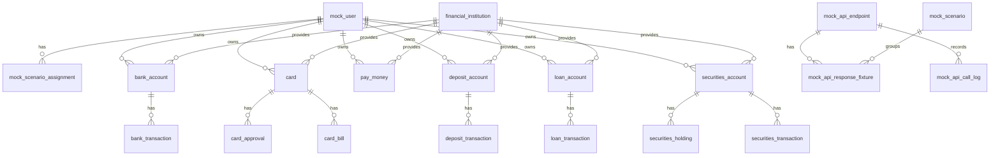

# Financial Mock Server

금융 API 연동 기능을 개발하고 테스트하기 위한 Spring MVC 기반 목 서버입니다.

실제 CODEF API를 매번 호출하지 않고, 로컬 MySQL의 mock 데이터를 조회해 안정적인 금융 응답을 제공합니다. 정상 응답뿐 아니라 빈 데이터, 토큰 만료, 호출 제한 같은 시나리오 응답도 함께 테스트할 수 있습니다.

## 목적

- 외부 금융 API 호출 없이 자산/거래/카드/대출 응답 테스트
- 사용자별 `scenarioKey` 기반 목 데이터 분기
- 정상 데이터는 DB 원천 테이블에서 조회해 응답 조립
- 오류/빈 데이터 등 특수 케이스는 fixture JSON으로 응답
- 실제 서비스 DB와 분리된 목 서버 전용 데이터 관리

## 현재 DB 기준

현재 코드가 조회하는 기준 스키마는 `src/main/resources/db/schema-v2.sql`입니다.

기존 `schema.sql`, `seed.sql`, `init.sql`에는 구버전 `mock_codef_*` 구조가 남아 있습니다. 현재 매퍼와 서비스는 주로 v2의 도메인 분리 테이블을 조회합니다.

## DB 구조

DB는 크게 두 영역으로 나뉩니다.

### 1. 목 응답 제어 영역

요청을 어떤 사용자, 어떤 API, 어떤 시나리오로 처리할지 결정하는 테이블입니다.

- `mock_user`: 테스트 사용자. `scenario_key`로 사용자를 식별합니다.
- `mock_scenario`: `NORMAL`, `EMPTY_DATA`, `TOKEN_EXPIRED`, `RATE_LIMITED` 같은 응답 시나리오입니다.
- `mock_api_endpoint`: 목 서버가 인식하는 API endpoint 목록입니다.
- `mock_scenario_assignment`: 사용자 또는 endpoint별 시나리오 배정 정보입니다.
- `mock_api_response_fixture`: NORMAL이 아닌 시나리오에서 반환할 고정 JSON 응답입니다.
- `mock_api_call_log`: 요청/응답 호출 이력을 저장합니다.

### 2. 금융 원천 데이터 영역

정상 시나리오에서 실제 응답을 조립할 때 조회하는 데이터입니다.

- `financial_institution`: 금융기관 마스터입니다. 은행, 카드사, 증권사, 페이머니 제공자를 포함합니다.
- `bank_account`: 입출금 계좌입니다.
- `bank_transaction`: 입출금 계좌 거래내역입니다.
- `card`: 카드 목록입니다.
- `card_approval`: 카드 승인내역입니다.
- `card_bill`: 카드 청구서입니다.
- `pay_money`: 페이머니/간편결제 잔액입니다.
- `deposit_account`: 예적금 계좌입니다.
- `deposit_transaction`: 예적금 거래내역입니다.
- `loan_account`: 대출 계좌입니다.
- `loan_transaction`: 대출 상환/거래내역입니다.
- `securities_account`: 증권 계좌입니다.
- `securities_holding`: 증권 보유 종목입니다.
- `securities_transaction`: 증권 거래내역입니다.

## ERD 요약



## 응답 처리 흐름

```text
요청 수신
-> method/path로 mock_api_endpoint 조회
-> scenarioKey로 mock_user 조회
-> 사용자 또는 endpoint에 배정된 mock_scenario 확인
-> NORMAL 시나리오면 금융 원천 테이블 조회 후 응답 조립
-> NORMAL이 아니면 mock_api_response_fixture.response_json 반환
-> mock_api_call_log 저장
```

`scenarioKey`는 query parameter 또는 `X-Scenario-Key` header로 전달할 수 있습니다. 값이 없으면 서비스에서 기본 테스트 사용자를 사용합니다.

특정 오류 시나리오를 강제로 사용하려면 query parameter `scenario` 또는 `X-Mock-Scenario` header에 `mock_scenario.scenario_code` 값을 전달합니다.

## 공통 응답 형식

모든 API 응답은 공통 envelope 구조를 사용합니다.

```json
{
  "code": "SUCCESS",
  "message": "조회 성공",
  "data": {},
  "traceId": "generated-trace-id",
  "timestamp": "server-time"
}
```

주요 시나리오:

- `NORMAL`: DB 원천 데이터 기반 정상 응답
- `EMPTY_DATA`: 빈 데이터 응답
- `TOKEN_EXPIRED`: 인증 토큰 만료 응답
- `RATE_LIMITED`: 외부 API 호출 제한 응답

## 현재 구현된 API

### 자산 API

- `GET /api/v1/assets/accounts`: 은행 계좌 목록 조회
- `GET /api/v1/assets/stocks`: 증권 계좌 요약 및 보유 종목 조회
- `GET /api/v1/assets/loans`: 대출 목록 조회
- `GET /api/v1/assets/payMoney`: 페이머니 목록 조회

### 원천 금융 API

- `GET /api/v1/accounts/{accountId}/transactions`: 은행 계좌 거래내역 조회
- `GET /api/v1/cards`: 카드 목록 조회
- `GET /api/v1/cards/{cardId}/approvals`: 카드 승인내역 조회

### CODEF 호환 API

- `POST /codef/v1/account/balance`: CODEF 호환 계좌 잔액 조회

## DB에는 있으나 아직 API가 없는 데이터

다음 테이블은 v2 DB와 seed에는 있지만, 현재 컨트롤러/매퍼 API가 아직 열려 있지 않습니다.

- `card_bill`: 카드 청구서
- `deposit_account`: 예적금 계좌
- `deposit_transaction`: 예적금 거래내역
- `loan_transaction`: 대출 상환/거래내역
- `securities_transaction`: 증권 거래내역

추가 후보 API:

- `GET /api/v1/assets/dashboard`
- `GET /api/v1/accounts/banks`
- `GET /api/v1/cards/{cardId}/bills`
- `GET /api/v1/deposits`
- `GET /api/v1/deposits/{depositId}/transactions`
- `GET /api/v1/loans/{loanId}/transactions`
- `GET /api/v1/securities/{accountId}/transactions`
- `GET /api/v1/transactions`

## Seed 데이터

v2 seed 기준 파일은 `src/main/resources/db/seed-v2.sql`입니다.

포함 데이터:

- 시나리오: `NORMAL`, `EMPTY_DATA`, `TOKEN_EXPIRED`, `RATE_LIMITED`
- 테스트 사용자:
  - `demo-normal-user`
  - `demo-empty-user`
- 금융기관 (34곳 — 탕탕 앱 `InstitutionCatalog` 전기관: 은행9·카드6·증권5·대출8·페이머니6):

  | 코드 | 이름 | 구분 |
  |---|---|---|
  | `0004` | KB국민은행 | BANK |
  | `0088` | 신한은행 | BANK |
  | `0090` | 카카오뱅크 | BANK |
  | `0020` | 우리은행 | BANK |
  | `0092` | 토스뱅크 | BANK |
  | `0081` | 하나은행 | BANK |
  | `0011` | NH농협은행 | BANK |
  | `0089` | 케이뱅크 | BANK |
  | `0003` | IBK기업은행 | BANK |
  | `0381` | KB국민카드 | CARD |
  | `0301` | 신한카드 | CARD |
  | `0361` | BC카드 | CARD |
  | `0364` | 삼성카드 | CARD |
  | `0366` | 현대카드 | CARD |
  | `0371` | 롯데카드 | CARD |
  | `0218` | KB증권 | SECURITIES |
  | `0240` | 삼성증권 | SECURITIES |
  | `0243` | 한국투자증권 | SECURITIES |
  | `0247` | NH투자증권 | SECURITIES |
  | `0261` | 교보증권 | SECURITIES |
  | `CP_KB` | KB캐피탈 | LOAN |
  | `CP_HYUNDAI` | 현대캐피탈 | LOAN |
  | `CP_SHINHAN` | 신한캐피탈 | LOAN |
  | `CP_HANA` | 하나캐피탈 | LOAN |
  | `CP_WOORI` | 우리금융캐피탈 | LOAN |
  | `SB_SBI` | SBI저축은행 | LOAN |
  | `SB_OK` | OK저축은행 | LOAN |
  | `SB_WELCOME` | 웰컴저축은행 | LOAN |
  | `PAY_KB` | KB Pay | PAY_MONEY |
  | `PAY_KAKAO` | 카카오페이 | PAY_MONEY |
  | `PAY_NAVER` | 네이버페이 | PAY_MONEY |
  | `PAY_TOSS` | 토스페이 | PAY_MONEY |
  | `PAY_PAYCO` | 페이코 | PAY_MONEY |
  | `PAY_CPANG` | 쿠팡페이 | PAY_MONEY |

  > ⚠ **기관 코드는 소비처(탕탕 앱)의 `InstitutionCatalog` 와 같아야 합니다.**
  > 앱은 계좌 응답의 `institutionCode` 로 "사용자가 고른 기관"과 대조해 거르므로,
  > 코드가 어긋난 계좌는 조회돼도 화면에서 통째로 버려집니다.
  > 2026-08-11 에 `0101`(KB국민카드) → `0381`, `0301`(구 KB증권) → `0218`(KB증권)으로 정정했습니다.
  > 2026-08-19 에 나머지 13개 기관(은행 4·카드 5·증권 4)을 추가해 카탈로그와 완전히 맞췄습니다.
  > `0301` 은 카탈로그 기준으로 원래부터 **신한카드**이며, 지금은 그 정체로 정식 등록되어 있습니다.
  > 2026-08-20 에 LOAN 업권(캐피탈 5·저축은행 3) 8곳을 추가했습니다. 그 전까지는 LOAN 타입
  > 기관이 하나도 없어 대출 계좌가 전부 BANK 기관(`0004`)에 잘못 연결돼 있었고,
  > `institutionCode` 가 `CP_*`/`SB_*` 형식으로 나가지 않아 앱의 `InstitutionCatalog.isLoanCode()`
  > 매칭이 항상 실패했습니다.
  > 2026-08-20 에 PAY_MONEY 업권도 5곳(카카오·네이버·토스·페이코·쿠팡페이) 추가했습니다.
  > 추가로 `pay_money.provider_code` 시드값이 `'KB_PAY'`(오타)로 들어가 있었습니다 — 기관
  > 조인 키는 `PAY_KB`로 맞는데 API 응답에 실리는 `provider_code` 컬럼만 따로 틀려 있어,
  > `InstitutionCatalog.isPayMoneyCode()`/아이콘 매칭이 항상 실패했고 계좌 연동 시
  > 기관 선택 코드(`PAY_KB`)와 비교가 어긋나 최초 동기화에서 KB Pay 가 아예 저장되지
  > 않는(0건) 문제까지 있었습니다. `'PAY_KB'` 로 정정했습니다.

- 정상 사용자용 샘플 데이터 (demo-normal-user 기준. 은행·카드·증권은 19개 기관 전체에 계좌가 있습니다):
  - **은행 계좌 13개 (9개 기관 전체) 및 계좌별 거래내역 2건씩**
    — 기관 선택 화면에는 은행이 9곳 뜨는데 계좌가 KB 하나뿐이라
    다른 기관을 고르면 조회 결과가 0건이던 문제를 해소했습니다(2026-08-11, 2026-08-19 은행 4곳 추가로 9곳 전체 커버)
  - **카드 6장 (6개 기관 전체)**, 카드별 승인내역/청구서 포함(2026-08-19 카드 5곳 추가)
  - 페이머니
  - 예적금 계좌 및 거래내역
  - 대출 계좌 및 상환내역
  - **증권 계좌 5개 (5개 기관 전체)**, 보유 종목·증권 거래내역 포함(2026-08-19 증권 4곳 추가)
- 빈 데이터/토큰 만료 fixture 응답

### scenario_key='2' (거래내역 카테고리 분류 테스트 전용)

별도 파일 `src/main/resources/db/seed-v2-scenario2.sql` 로 분리돼 있습니다(2026-08-19 추가).
`seed-v2.sql` 이 넣는 `financial_institution`(KB국민은행 `0004`)에 의존하므로
**`schema-v2.sql` → `seed-v2.sql` → `seed-v2-scenario2.sql` 순서로 적용**해야 합니다.

은행 계좌 1개만 두고, 2026-04-01~2026-08-31(153일) 매일 2~5건씩 `db/seed_category.sql` 기준
소분류 44개를 전부 커버하는 거래내역을 채웁니다. 날짜·슬롯 기반 결정론적 MOD 연산으로 생성해
재실행해도 같은 결과가 나옵니다(멱등).

### scenario_key='3' (카드 승인/은행 정합성 검증 전용)

별도 파일 `src/main/resources/db/seed-v2-scenario3.sql` 로 분리돼 있습니다(2026-08-19 추가).
`seed-v2.sql` 이 넣는 `financial_institution`(KB국민은행 `0004`, KB국민카드 `0381`)에
의존하므로 **`schema-v2.sql` → `seed-v2.sql` → `seed-v2-scenario3.sql` 순서로 적용**해야 합니다.

scenario_key='2' 가 카드 없이 거래내역 카테고리 다양성만 다뤘다면, 이 시나리오는 **카드
승인내역(card_approval)과 은행 입출금(bank_transaction) 두 소스를 합쳐 거래를 감지하는
탕탕 앱의 실제 동작**을 재현합니다. 은행 계좌 1개 + 신용카드 1장(`card_type_code='01'`) +
체크카드 1장(`card_type_code='02'`)을 두고, 소비를 3갈래로 나눠 기록합니다:

- **그룹 A (자동이체, 12개 소분류)** — 카드 없이 `bank_transaction` 에 매월 1회 직접 기록
  (월세·관리비·공과금·통신비·구독료·보험료·금융상품 등)
- **그룹 B (체크카드, 나머지 32개 소분류 중 ~30%)** — `card_approval` 1행 + `bank_transaction`
  1행을 같은 `correlationId` 로 묶어 "같은 사건의 두 소스 표현"을 재현
- **그룹 C (신용카드, 나머지 32개 소분류 중 ~70%)** — `card_approval` 에만 개별 소비를 기록하고,
  `bank_transaction` 에는 그 달 신용카드 승인합계와 정확히 같은 금액의 "카드 이용대금" 1건만
  다음달 14일에 기록(정산행의 `challengeCategory` 는 `NULL` — 이미 `card_approval` 로 잡힌
  소비가 이중계산되지 않도록 함). `card_bill` 도 같은 합계로 월별 1건씩 생성됩니다.

2026-04-01~2026-08-31(153일) 매일 2~5건의 소비 이벤트(그룹 B 는 이벤트 1건당 row 2개) +
그룹 A 월 1회 자동이체로 44개 소분류를 전부 커버합니다. 날짜·슬롯 기반 결정론적 MOD 연산으로
생성해 재실행해도 같은 결과가 나옵니다(멱등 — 로컬 검증 시 재실행 전/후 행 수·잔액 동일 확인).

### scenario_key='4' (카드 승인/은행 정합성 검증 — 병렬 사용자)

별도 파일 `src/main/resources/db/seed-v2-scenario4.sql` 로 분리돼 있습니다(2026-08-19 추가).
`seed-v2.sql` 이 넣는 `financial_institution`(KB국민은행 `0004`, KB국민카드 `0381`)에
의존하므로 **`schema-v2.sql` → `seed-v2.sql` → `seed-v2-scenario4.sql` 순서로 적용**해야 합니다.

scenario_key='3' 과 **완전히 동일한 그룹 A/B/C 구조**(계좌 1개, 신용카드 1장 + 체크카드 1장,
결정론적 MOD 생성 로직)를 그대로 재사용하는 독립된 사용자입니다 — 계좌/카드 번호만 다르고
(`004909******4004`, `9490-****-****-4401`, `5210-****-****-4402`) 나머지 로직·검증 결과는
scenario 3 과 동일합니다(카드 정합성 로직을 여러 사용자로 병렬 테스트할 때 사용). 상세 구조는
바로 위 scenario_key='3' 절을 참고하세요.

### scenario_key='5' (카드 승인/은행 정합성 검증 — 병렬 사용자)

별도 파일 `src/main/resources/db/seed-v2-scenario5.sql` 로 분리돼 있습니다(2026-08-19 추가).
`seed-v2.sql` 이 넣는 `financial_institution`(KB국민은행 `0004`, KB국민카드 `0381`)에
의존하므로 **`schema-v2.sql` → `seed-v2.sql` → `seed-v2-scenario5.sql` 순서로 적용**해야 합니다.

scenario_key='3'/'4' 와 **완전히 동일한 그룹 A/B/C 구조**(계좌 1개, 신용카드 1장 + 체크카드 1장,
결정론적 MOD 생성 로직)를 그대로 재사용하는 독립된 사용자입니다 — 계좌/카드 번호만 다르고
(`004909******5005`, `9490-****-****-5501`, `5210-****-****-5502`) 나머지 로직·검증 결과는
scenario 3/4 와 동일합니다(카드 정합성 로직을 여러 사용자로 병렬 테스트할 때 사용). 상세 구조는
scenario_key='3' 절을 참고하세요. 로컬 검증 결과: `card_approval` 538건 · `bank_transaction`
235건 · `card_bill` 5건, 44개 소분류 전부 커버, `MIN(balance_after)` 611,200원(마이너스 없음),
재실행 전/후 행 수 동일(멱등).

### scenario_key='6' (카드 승인/은행 정합성 검증 — 병렬 사용자)

별도 파일 `src/main/resources/db/seed-v2-scenario6.sql` 로 분리돼 있습니다(2026-08-19 추가).
`seed-v2.sql` 이 넣는 `financial_institution`(KB국민은행 `0004`, KB국민카드 `0381`)에
의존하므로 **`schema-v2.sql` → `seed-v2.sql` → `seed-v2-scenario6.sql` 순서로 적용**해야 합니다.

scenario_key='3'/'4'/'5' 와 **완전히 동일한 그룹 A/B/C 구조**(계좌 1개, 신용카드 1장 + 체크카드 1장,
결정론적 MOD 생성 로직)를 그대로 재사용하는 독립된 사용자입니다 — 계좌/카드 번호만 다르고
(`004909******6006`, `9490-****-****-6601`, `5210-****-****-6602`), scenario5 가 scenario3 의
MOD 계수를 그대로 재사용해 소비 패턴이 사실상 같았던 것과 달리 이 시나리오는 scenario4 처럼
계수를 새로 골라 날짜별 카테고리·금액·체크/신용 배정이 실제로 다르게 나옵니다. 상세 구조는
scenario_key='3' 절을 참고하세요. 로컬 검증 결과: `card_approval` 538건 · `bank_transaction`
235건 · `card_bill` 5건, 44개 소분류 전부 커버, 신용카드 월별 정산 금액이 그 달 `card_approval`
합계와 정확히 일치(이중계산 없음), 체크카드 쌍은 `correlationId` 기준으로 양쪽 금액 전부 일치,
`MIN(balance_after)` 1,085,700원(마이너스 없음), 재실행 전/후 행 수 동일(멱등).

### scenario_key='7' (카드 승인/은행 정합성 검증 — 병렬 사용자)

별도 파일 `src/main/resources/db/seed-v2-scenario7.sql` 로 분리돼 있습니다(2026-08-19 추가).
`seed-v2.sql` 이 넣는 `financial_institution`(KB국민은행 `0004`, KB국민카드 `0381`)에
의존하므로 **`schema-v2.sql` → `seed-v2.sql` → `seed-v2-scenario7.sql` 순서로 적용**해야 합니다.

scenario_key='3'/'4'/'5'/'6' 과 **완전히 동일한 그룹 A/B/C 구조**(계좌 1개, 신용카드 1장 +
체크카드 1장, 결정론적 MOD 생성 로직)를 그대로 재사용하는 독립된 사용자입니다 — 계좌/카드
번호만 다르고(`004909******7007`, `9490-****-****-7701`, `5210-****-****-7702`),
scenario4/6 처럼 `is_large`/`is_checkcard`/`small_bc`/`large_bc`/`daily_count` 의 곱셈
계수를 3/4/5/6 어느 것과도 겹치지 않는 새 값으로 골라 날짜별 카테고리·금액·체크/신용
배정이 실제로 다르게 나옵니다. 상세 구조는 scenario_key='3' 절을 참고하세요. 로컬 검증
결과: `card_approval` 533건 · `bank_transaction` 229건 · `card_bill` 5건, 44개 소분류
전부 커버, 신용카드 월별 정산 금액이 그 달 `card_approval` 합계와 정확히 일치(이중계산
없음, 정산행 `challengeCategory` 는 JSON `null`), 체크카드 쌍은 `correlationId` 기준으로
양쪽 금액 전부 일치, `MIN(balance_after)` 1,750,000원(마이너스 없음), 재실행 전/후 행 수
동일(멱등).

### scenario_key='8' (카드 승인/은행 정합성 검증 — 병렬 사용자)

별도 파일 `src/main/resources/db/seed-v2-scenario8.sql` 로 분리돼 있습니다(2026-08-19 추가).
`seed-v2.sql` 이 넣는 `financial_institution`(KB국민은행 `0004`, KB국민카드 `0381`)에
의존하므로 **`schema-v2.sql` → `seed-v2.sql` → `seed-v2-scenario8.sql` 순서로 적용**해야 합니다.

scenario_key='3'/'4'/'5'/'6'/'7' 과 **완전히 동일한 그룹 A/B/C 구조**(계좌 1개, 신용카드 1장 +
체크카드 1장, 결정론적 MOD 생성 로직)를 그대로 재사용하는 독립된 사용자입니다 — 계좌/카드
번호만 다르고(`004909******8008`, `9490-****-****-8801`, `5210-****-****-8802`),
scenario4/6/7 처럼 `is_large`/`is_checkcard`/`small_bc`/`large_bc`/`daily_count` 의 곱셈
계수를 3/4/5/6/7 어느 것과도 겹치지 않는 새 값으로 골라 날짜별 카테고리·금액·체크/신용
배정이 실제로 다르게 나옵니다. 상세 구조는 scenario_key='3' 절을 참고하세요. 로컬 검증
결과: `card_approval` 535건 · `bank_transaction` 234건 · `card_bill` 5건, 44개 소분류
전부 커버, 신용카드 월별 정산 금액이 그 달 `card_approval` 합계와 정확히 일치(이중계산
없음, 정산행 `challengeCategory` 는 JSON `null`), 체크카드 쌍은 `correlationId` 기준으로
양쪽 금액 전부 일치, `MIN(balance_after)` 646,900원(마이너스 없음), 재실행 전/후 행 수
동일(멱등).

### scenario_key='9' (카드 승인/은행 정합성 검증 — 병렬 사용자)

별도 파일 `src/main/resources/db/seed-v2-scenario9.sql` 로 분리돼 있습니다(2026-08-19 추가).
`seed-v2.sql` 이 넣는 `financial_institution`(KB국민은행 `0004`, KB국민카드 `0381`)에
의존하므로 **`schema-v2.sql` → `seed-v2.sql` → `seed-v2-scenario9.sql` 순서로 적용**해야 합니다.

scenario_key='3'/'4'/'5'/'6'/'7'/'8' 과 **완전히 동일한 그룹 A/B/C 구조**(계좌 1개, 신용카드
1장 + 체크카드 1장, 결정론적 MOD 생성 로직)를 그대로 재사용하는 독립된 사용자입니다 —
계좌/카드 번호만 다르고(`004909******9009`, `9490-****-****-9901`, `5210-****-****-9902`),
scenario4/6/7/8 처럼 `is_large`/`is_checkcard`/`small_bc`/`large_bc`/`daily_count` 의 곱셈
계수를 3/4/5/6/7/8 어느 것과도 겹치지 않는 새 값으로 골라 날짜별 카테고리·금액·체크/신용
배정이 실제로 다르게 나옵니다. 상세 구조는 scenario_key='3' 절을 참고하세요. 초기에 골랐던
large idx 계수(97/101)는 로컬 검증에서 고액군 15개 중 2개(주유/충전·숙박)가 153일 동안 한
번도 안 뽑히는 걸 발견해 139/109 로 교체했습니다(고액군은 전체 이벤트의 ~6%뿐이라 표본이
작아 계수에 따라 특정 잔차가 통째로 비는 경우가 생길 수 있음 — 계수를 바꿀 때는 반드시
44개 소분류 커버리지를 다시 확인할 것). 로컬 검증 결과: `card_approval` 524건 ·
`bank_transaction` 230건 · `card_bill` 5건, 44개 소분류 전부 커버, 신용카드 월별 정산
금액이 그 달 `card_approval` 합계와 정확히 일치(이중계산 없음, 정산행 `challengeCategory` 는
JSON `null`), 체크카드 쌍은 `correlationId` 기준으로 양쪽 금액 전부 일치, `MIN(balance_after)`
747,400원(마이너스 없음), 재실행 전/후 행 수 동일(멱등).

## 개발 환경

- Java 17
- Spring MVC 5
- Gradle
- MyBatis
- MySQL 8

## 데이터베이스 설정

기본 데이터베이스 이름은 `financial_mock`입니다.

```sql
CREATE DATABASE IF NOT EXISTS financial_mock
  DEFAULT CHARACTER SET utf8mb4
  DEFAULT COLLATE utf8mb4_unicode_ci;
```

로컬 DB 접속 정보는 `src/main/resources/application.properties`에서 관리합니다.

```properties
jdbc.url=jdbc:log4jdbc:mysql://localhost:3306/financial_mock
jdbc.username=root
jdbc.password=1234
```

## 디렉터리 구조

```text
src/main/java/com/financial/mockserver
  config/              Spring 설정
  controller/          API controller
  domain/              mock 응답 제어용 내부 모델
  dto/                 API 응답 DTO
  mapper/              MyBatis mapper interface
  service/             서비스 인터페이스 및 구현체
  support/             공통 응답/trace helper

src/main/resources
  db/schema-v2.sql          현재 DB schema 기준
  db/seed-v2.sql            현재 seed 데이터 기준
  db/seed-v2-scenario2.sql  scenario_key='2' 거래내역 카테고리 테스트 (seed-v2.sql 이후 적용)
  db/seed-v2-scenario3.sql  scenario_key='3' 카드 승인/은행 정합성 테스트 (seed-v2.sql 이후 적용)
  db/seed-v2-scenario4.sql  scenario_key='4' 카드 승인/은행 정합성 테스트, 병렬 사용자 (seed-v2.sql 이후 적용)
  db/seed-v2-scenario5.sql  scenario_key='5' 카드 승인/은행 정합성 테스트, 병렬 사용자 (seed-v2.sql 이후 적용)
  db/seed-v2-scenario6.sql  scenario_key='6' 카드 승인/은행 정합성 테스트, 병렬 사용자 (seed-v2.sql 이후 적용)
  db/seed-v2-scenario7.sql  scenario_key='7' 카드 승인/은행 정합성 테스트, 병렬 사용자 (seed-v2.sql 이후 적용)
  db/seed-v2-scenario8.sql  scenario_key='8' 카드 승인/은행 정합성 테스트, 병렬 사용자 (seed-v2.sql 이후 적용)
  db/seed-v2-scenario9.sql  scenario_key='9' 카드 승인/은행 정합성 테스트, 병렬 사용자 (seed-v2.sql 이후 적용)
  db/schema.sql             구버전 mock_codef_* schema
  db/seed.sql               구버전 seed
  db/init.sql               구버전 통합 실행 스크립트
  mapper/              MyBatis XML mapper
  application.properties
  mybatis-config.xml

documents/
  financial-mock-erd.svg
  IMPLEMENTATION_GUIDE.md
  API/기능 명세 참고 문서
```

## 구현 메모

- `domain` 패키지는 금융 도메인 객체가 아니라 mock 응답 제어용 모델 중심입니다.
- 금융 테이블은 현재 MyBatis XML에서 응답 DTO로 직접 매핑합니다.
- 정상 시나리오는 DB 테이블 조회 결과로 응답을 조립합니다.
- 오류/빈 데이터 같은 특수 시나리오는 fixture JSON을 반환합니다.
- 실제 서비스 DB와 목 서버 DB를 섞지 않습니다.
- 민감한 인증정보나 실제 계좌번호는 저장하지 않고, 마스킹된 테스트 값만 사용합니다.

## 참고 문서

- `documents/IMPLEMENTATION_GUIDE.md`
- `documents/financial-mock-erd.svg`
- `documents/CPR_기능명세서-v8.xlsm`
- `documents/탕탕_API_연동규격_정의서_v1.0.xlsm`
