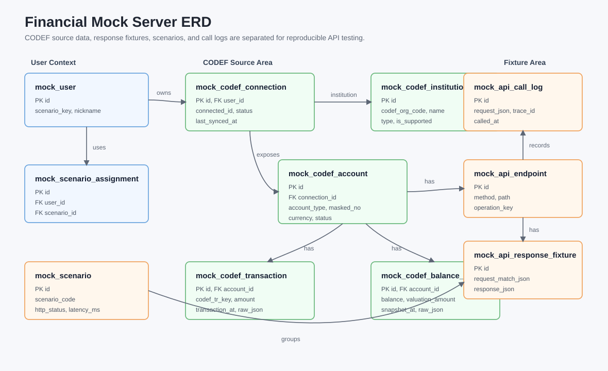
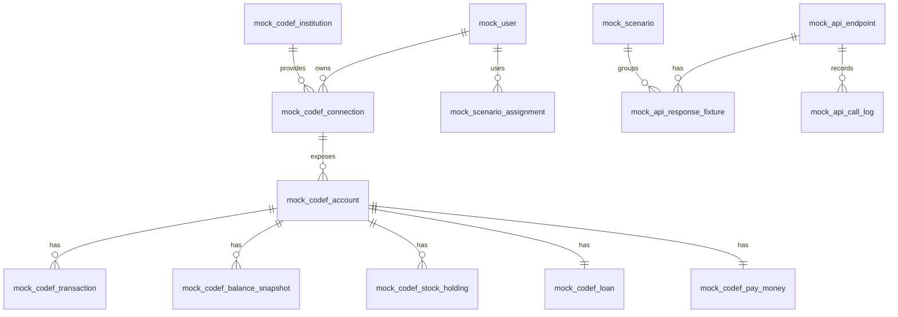

# Financial Mock Server

CODEF API 호출 제한과 외부 연동 불안정성에 영향을 받지 않고 금융 데이터 연동 기능을 개발·테스트하기 위한 목 서버입니다.

이 서버는 실제 CODEF API를 완전히 대체하는 운영용 서버가 아니라, 프론트엔드와 백엔드 개발 과정에서 필요한 금융 API 응답을 안정적으로 재현하는 개발용 서버를 목표로 합니다.

## 목적

- CODEF API 호출 제한으로 인한 개발 지연 최소화
- 계좌, 거래내역, 잔액, 자산 요약 등 금융 응답 데이터 재현
- 은행, 증권, 대출, 페이머니 자산 테스트 데이터 제공
- 정상, 빈 데이터, 인증 만료, 외부 API 실패, 호출 제한 등 다양한 시나리오 테스트
- 프론트엔드·백엔드 연동 테스트용 응답 제공
- 실제 서비스 ERD와 분리된 목 서버 전용 mock 데이터 관리

## 설계 방향

목 서버의 데이터는 크게 두 영역으로 나눕니다.





### 1. CODEF 원천 mock 영역

실제 CODEF에서 내려올 법한 금융 데이터를 저장하는 영역입니다. 정상 응답은 이 영역의 데이터를 조회해 서버에서 JSON으로 조립합니다.

주요 테이블:

- `mock_codef_institution`: 금융기관 마스터
- `mock_codef_connection`: 사용자별 CODEF 연결 상태
- `mock_codef_account`: 은행, 증권, 대출, 페이머니 공통 금융 계정
- `mock_codef_transaction`: 계정별 거래내역 원천 데이터
- `mock_codef_balance_snapshot`: 잔액·평가금액 스냅샷
- `mock_codef_stock_holding`: 증권 보유종목 상세
- `mock_codef_loan`: 대출 상세
- `mock_codef_pay_money`: 페이머니·간편결제 잔액 상세

### 2. Fixture 응답 영역

특정 시나리오에 대해 고정 응답 JSON을 저장하는 영역입니다. 빈 데이터, 오류, 호출 제한, 외부 API 장애처럼 의도적으로 고정해야 하는 응답에 사용합니다.

주요 테이블:

- `mock_api_endpoint`: 목 서버가 제공하는 API 목록
- `mock_scenario`: 정상·오류·빈 데이터 등 테스트 시나리오
- `mock_api_response_fixture`: 요청 매칭 조건과 고정 응답 JSON
- `mock_api_call_log`: 요청·응답 호출 이력
- `mock_scenario_assignment`: 사용자 또는 endpoint별 시나리오 할당

## 응답 생성 전략

기본 전략은 다음과 같습니다.

```text
요청 수신
-> scenarioKey 확인
-> 정상 시나리오면 mock_codef_* 원천 데이터 조회
-> 서버에서 response JSON 조립
-> 응답 반환
-> mock_api_call_log 저장
```

단, 다음 상황은 `mock_api_response_fixture.response_json`을 그대로 반환할 수 있습니다.

- 빈 데이터 응답
- 토큰 만료 응답
- CODEF 호출 제한 응답
- CODEF 연동 실패 응답
- CODEF 일시 장애 응답
- 특정 화면 시연을 위해 고정해야 하는 응답

## 기본 응답 원칙

모든 API 응답은 공통 envelope 구조를 따릅니다.

```json
{
  "code": "SUCCESS",
  "message": "조회 성공",
  "data": {},
  "traceId": "generated-trace-id",
  "timestamp": "server-time"
}
```

오류 응답도 동일한 envelope 구조를 사용하며, HTTP 상태와 애플리케이션 코드를 함께 관리합니다.

예상 오류 시나리오:

- `401 TOKEN_EXPIRED`: 인증 토큰 만료
- `404 NOT_FOUND`: 계좌 또는 거래내역 없음
- `429 RATE_LIMITED`: 외부 API 호출 제한
- `502 EXTERNAL_API_ERROR`: CODEF 연동 실패
- `503 EXTERNAL_API_UNAVAILABLE`: 외부 API 일시 장애

## 지원 자산 범위

현재 목 데이터는 다음 자산 유형을 지원합니다.

- 은행 계좌: 입출금 계좌, 잔액, 거래내역
- 증권: 증권 계좌, 보유종목, 평가금액, 매수·배당 거래내역
- 대출: 대출 계좌, 원금, 잔액, 금리, 상환 거래내역
- 페이머니: 간편결제 잔액, 포인트, 충전·결제·적립 거래내역

## 주요 API 범위

초기 목 서버에서 우선 지원할 API 범위는 다음과 같습니다.

- `GET /api/v1/assets/accounts`: 은행 자산 상세 조회
- `GET /api/v1/assets/stocks`: 주식 자산 상세 조회
- `GET /api/v1/assets/loans`: 대출 상세 조회
- `GET /api/v1/assets/payMoney`: 페이머니 상세 조회
- `GET /api/v1/transactions`: 은행·증권·대출·페이머니 통합 거래내역 조회
- `POST /codef/v1/account/balance`: CODEF 잔액 응답 목

이후 확장 후보:

- `GET /api/v1/accounts/banks`
- `GET /api/v1/assets/dashboard`
- `GET /api/v1/transactions/monthly`
- `GET /api/v1/transactions/search`

## Seed 데이터 현황

DB 스크립트는 schema와 seed를 분리해서 관리합니다.

- `src/main/resources/db/schema.sql`: 테이블, 인덱스, FK 정의
- `src/main/resources/db/seed.sql`: 시나리오, endpoint, 테스트 사용자, 자산/거래내역, fixture 데이터
- `src/main/resources/db/init.sql`: 기존 실행 흐름 호환을 위한 schema + seed 통합본

seed에는 현재 구현된 자산/거래내역 API용 정상 데이터와, 확장 예정 endpoint를 포함한 빈 데이터/오류 시나리오 fixture가 포함되어 있습니다.

## 개발 환경

- Java 17
- Spring MVC 5
- Gradle
- MyBatis
- MySQL 8

## 데이터베이스

기본 데이터베이스 이름은 `financial_mock`입니다.

```sql
CREATE DATABASE IF NOT EXISTS financial_mock
  DEFAULT CHARACTER SET utf8mb4
  DEFAULT COLLATE utf8mb4_unicode_ci;
```

로컬 DB 접속 정보는 `src/main/resources/application.properties`에서 관리합니다.

## 디렉터리 구조

```text
src/main/java/com/financial/mockserver
  config/              Spring 설정

src/main/resources
  db/schema.sql        DB schema 스크립트
  db/seed.sql          초기 seed 데이터 스크립트
  db/init.sql          schema + seed 통합 호환 스크립트
  application.properties
  mybatis-config.xml

documents/
  API 연동 규격서
  기능 명세서
  목 서버 설계 참고 문서
  financial-mock-erd.svg
  IMPLEMENTATION_GUIDE.md
```

## 구현 우선순위

1. `scenarioKey` 기반 사용자/시나리오 확인 구현
2. `mock_codef_*` 원천 데이터 조회 Mapper 구현
3. 자산별 응답 JSON 조립 Service 구현
4. 통합 거래내역 조회 API 구현
5. 빈 데이터·오류·호출 제한 fixture fallback 구현
6. `mock_api_call_log` 호출 이력 저장 구현
7. 계좌·증권·대출·페이머니 자산 조회 API 구현
8. CODEF 잔액 목 API 구현

## 운영 원칙

- 실제 CODEF 인증정보나 민감정보를 저장하지 않습니다.
- 계좌번호는 마스킹 또는 암호화된 테스트 값만 사용합니다.
- 거래내역처럼 자주 바뀌는 데이터는 JSON fixture만 수정하지 않고 원천 mock 테이블에 저장합니다.
- fixture JSON은 빈 데이터, 오류, 호출 제한 등 명시적 시나리오에 사용합니다.
- 서비스 본 서버의 도메인 DB와 목 서버 mock DB를 혼합하지 않습니다.
- 외부 API 장애 상황도 정상 시나리오만큼 중요하게 관리합니다.

## 참고 문서

- `documents/CPR_기능명세서-v8.xlsm`
- `documents/탕탕_API_연동규격_정의서_v1.0.xlsm`
- `documents/mock-server.xlsx`
- `documents/IMPLEMENTATION_GUIDE.md`
