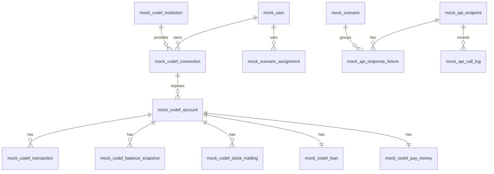

# Financial Mock Server

CODEF API 호출 제한과 외부 연동 불안정성에 영향을 받지 않고 금융 데이터 연동 기능을 개발·테스트하기 위한 목 서버입니다.

이 서버는 실제 CODEF API를 완전히 대체하는 운영용 서버가 아니라, 프론트엔드와 백엔드 개발 과정에서 필요한 금융 API 응답을 안정적으로 재현하는 개발용 서버를 목표로 합니다.

## 목적

- CODEF API 호출 제한으로 인한 개발 지연 최소화
- 계좌, 거래내역, 잔액, 자산 요약 등 금융 응답 데이터 재현
- 은행, 증권, 대출, 페이머니 자산 테스트 데이터 제공
- 정상, 빈 데이터, 인증 만료, 외부 API 실패, 호출 제한 등 다양한 시나리오 테스트
- 프론트엔드·백엔드 연동 테스트용 고정 응답 제공
- 실제 서비스 ERD와 분리된 목 서버 전용 fixture 관리

## 설계 방향

목 서버의 데이터는 크게 두 영역으로 나눕니다.




### 1. CODEF 원천 응답 영역

CODEF에서 내려오는 응답 구조를 최대한 보존하는 영역입니다. 실제 API 응답과 유사한 JSON을 저장하고, 요청 조건과 시나리오에 따라 적절한 응답을 반환합니다.

주요 테이블:

- `mock_codef_institution`: 금융기관 마스터
- `mock_codef_connection`: 사용자별 CODEF 연결 상태
- `mock_codef_account`: 은행, 증권, 대출, 페이머니 공통 금융 계정
- `mock_codef_transaction`: 계정별 거래내역 원천 데이터
- `mock_codef_balance_snapshot`: 잔액·평가금액 스냅샷
- `mock_codef_stock_holding`: 증권 보유종목 상세
- `mock_codef_loan`: 대출 상세
- `mock_codef_pay_money`: 페이머니·간편결제 잔액 상세

### 2. 목 API 시나리오 영역

특정 API 호출에 대해 어떤 응답을 반환할지 제어하는 영역입니다.

주요 테이블:

- `mock_api_endpoint`: 목 서버가 제공하는 API 목록
- `mock_scenario`: 정상·오류·빈 데이터 등 테스트 시나리오
- `mock_api_response_fixture`: 요청 매칭 조건과 응답 JSON
- `mock_api_call_log`: 요청·응답 호출 이력
- `mock_scenario_assignment`: 사용자 또는 endpoint별 시나리오 할당

## 기본 응답 원칙

모든 API 응답은 공통 envelope 구조를 따릅니다.

```json
{
  "code": "SUCCESS",
  "message": "조회 성공",
  "data": {},
  "traceId": "01J3EXAMPLETRACE",
  "timestamp": "2026-07-31T10:30:00+09:00"
}
```

오류 응답도 동일한 envelope 구조를 사용하며, HTTP 상태와 애플리케이션 코드를 함께 관리합니다.

예상 오류 시나리오:

- `401 TOKEN_EXPIRED`: 인증 토큰 만료
- `404 NOT_FOUND`: 계좌 또는 거래내역 없음
- `429 RATE_LIMITED`: 외부 API 호출 제한
- `502 EXTERNAL_API_ERROR`: CODEF 연동 실패
- `503 EXTERNAL_API_UNAVAILABLE`: 외부 API 일시 장애

## 지원 자산 범위

현재 목 데이터는 다음 자산 유형을 지원합니다.

- 은행 계좌: 입출금 계좌, 잔액, 거래내역
- 증권: 증권 계좌, 보유종목, 평가금액, 매수·배당 거래내역
- 대출: 대출 계좌, 원금, 잔액, 금리, 상환 거래내역
- 페이머니: 간편결제 잔액, 포인트, 충전·결제·적립 거래내역

## 주요 API 범위

초기 목 서버에서 우선 지원할 API 범위는 다음과 같습니다.

- `GET /api/v1/assets/accounts`: 은행 자산 상세 조회
- `GET /api/v1/assets/stocks`: 주식 자산 상세 조회
- `GET /api/v1/assets/loans`: 대출 상세 조회
- `GET /api/v1/assets/payMoney`: 페이머니 상세 조회
- `GET /api/v1/transactions`: 은행·증권·대출·페이머니 통합 거래내역 조회
- `POST /codef/v1/account/balance`: CODEF 잔액 응답 목

이후 확장 후보:

- `GET /api/v1/accounts/banks`
- `GET /api/v1/assets/dashboard`
- `GET /api/v1/transactions/monthly`
- `GET /api/v1/transactions/search`

## Seed 데이터 현황

`src/main/resources/db/init.sql`에는 다음 seed 데이터가 포함되어 있습니다.

- 기본 시나리오 6건: 정상, 빈 데이터, 토큰 만료, 호출 제한, 외부 API 실패, 외부 API 일시 장애
- API endpoint 16건
- 테스트 사용자 2건: `demo-normal-user`, `demo-empty-user`
- 금융기관 4건
- CODEF 연결 2건
- 금융 계정 4건: 은행, 증권, 대출, 페이머니
- 은행 거래내역 3건
- 증권 거래내역 3건: 삼성전자 매수, 카카오 매수, 배당금 입금
- 페이머니 거래내역 3건: 충전, 편의점 결제, 포인트 적립
- 대출 거래내역 3건: 대출 실행, 원리금 상환, 이자 납입
- 증권 보유종목 2건
- 대출 상세 1건
- 페이머니 상세 1건
- 응답 fixture 12건

## 개발 환경

- Java 17
- Spring MVC 5
- Gradle
- MyBatis
- MySQL 8

## 데이터베이스

기본 데이터베이스 이름은 `financial_mock`입니다.

```sql
CREATE DATABASE IF NOT EXISTS financial_mock
  DEFAULT CHARACTER SET utf8mb4
  DEFAULT COLLATE utf8mb4_unicode_ci;
```

로컬 DB 접속 정보는 `src/main/resources/application.properties`에서 관리합니다.

## 디렉터리 구조

```text
src/main/java/com/financial/mockserver
  config/              Spring 설정

src/main/resources
  db/init.sql          초기 DB 생성 및 seed 스크립트
  application.properties
  mybatis-config.xml

documents/
  API 연동 규격서
  기능 명세서
  목 서버 설계 참고 문서
  financial-mock-erd.svg
```

## 구현 우선순위

1. fixture 조회 Mapper 구현
2. 요청 조건과 `scenarioKey` 기반 fixture 매칭 구현
3. 공통 envelope JSON 반환 구현
4. `mock_api_call_log` 호출 이력 저장 구현
5. 계좌 목록 조회 API 구현
6. 증권·대출·페이머니 자산 조회 API 구현
7. 통합 거래내역 조회 API 구현
8. 오류·지연·호출 제한 시나리오 구현

## 운영 원칙

- 실제 CODEF 인증정보나 민감정보를 저장하지 않습니다.
- 계좌번호는 마스킹 또는 암호화된 테스트 값만 사용합니다.
- fixture JSON은 재현 가능해야 하며, 임의 응답보다 명시적인 시나리오를 우선합니다.
- 서비스 본 서버의 도메인 DB와 목 서버 fixture DB를 혼합하지 않습니다.
- 외부 API 장애 상황도 정상 시나리오만큼 중요하게 관리합니다.

## 참고 문서

- `documents/CPR_기능명세서-v8.xlsm`
- `documents/탕탕_API_연동규격_정의서_v1.0.xlsm`
- `documents/mock-server.xlsx`
- `documents/IMPLEMENTATION_GUIDE.md`
